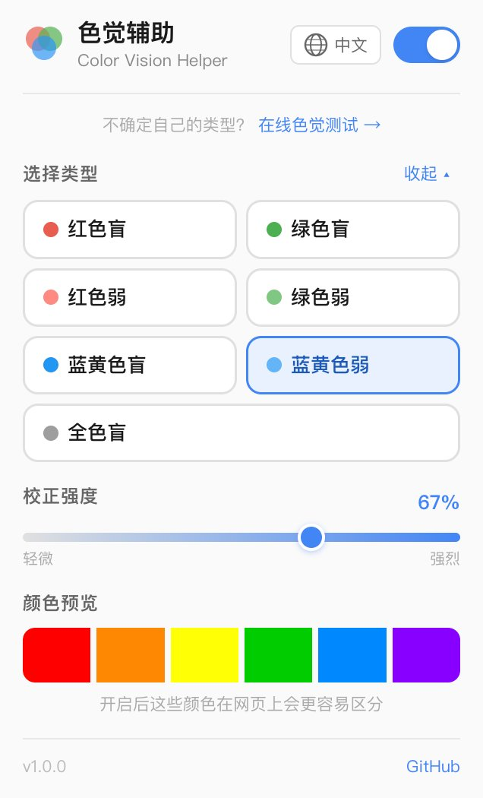

# Color Vision Helper 🎨 色觉辅助工具

**中文** | [English](#english)

---

## 中文

一款帮助色盲和色弱用户更好地识别网页颜色的 Chrome 浏览器插件。

<p align="center">
  
</p>

### 功能

- **7 种色觉类型支持** — 红色盲、绿色盲、红色弱、绿色弱、蓝黄色盲、蓝黄色弱、全色盲
- **强度可调** — 0–100% 滑块，适配不同程度的色觉异常
- **6 种语言** — 中文、English、Français、Español、Русский、العربية
- **实时生效** — 即开即用，无需刷新页面
- **记忆设置** — 关闭浏览器后重新打开，设置自动恢复
- **轻量无侵入** — 使用 SVG 滤镜，不修改网页 DOM

### 支持的色觉类型

| 类型 | 英文 | 说明 |
|------|------|------|
| 红色盲 | Protanopia | 缺少红色感受器 |
| 绿色盲 | Deuteranopia | 缺少绿色感受器 |
| 红色弱 | Protanomaly | 红色感受器异常 |
| 绿色弱 | Deuteranomaly | 绿色感受器异常（最常见） |
| 蓝黄色盲 | Tritanopia | 缺少蓝色感受器 |
| 蓝黄色弱 | Tritanomaly | 蓝色感受器异常 |
| 全色盲 | Achromatopsia | 无法感知颜色 |

### 安装方式

#### 开发者模式（测试用）

1. 下载或 clone 本仓库
2. 打开 Chrome，地址栏输入 `chrome://extensions`
3. 开启右上角「开发者模式」
4. 点击「加载已解压的扩展程序」
5. 选择本项目文件夹
6. 点击浏览器右上角的插件图标即可使用

#### Chrome Web Store

> 即将上架，敬请期待。

### 工作原理

插件通过 SVG `feColorMatrix` 滤镜对页面颜色进行矩阵变换。不同类型的色觉异常使用不同的校正矩阵，将难以区分的颜色重新映射到用户可以感知的色域范围内。强度滑块通过在单位矩阵和校正矩阵之间做线性插值，实现平滑过渡。

### 技术栈

- Manifest V3 — Chrome 最新扩展标准
- SVG feColorMatrix — 基于色彩矩阵变换的滤镜方案
- Chrome Storage API — 持久化用户设置
- 无外部依赖，纯原生 JavaScript

---

<a name="english"></a>

## English

A Chrome extension that helps people with color vision deficiency browse the web more comfortably.

<p align="center">
  
</p>

### Features

- **7 color vision types** — Protanopia, Deuteranopia, Protanomaly, Deuteranomaly, Tritanopia, Tritanomaly, Achromatopsia
- **Adjustable intensity** — 0–100% slider to match different severity levels
- **6 languages** — 中文, English, Français, Español, Русский, العربية
- **Real-time correction** — Works instantly, no page refresh needed
- **Remembers settings** — Your preferences are saved across browser sessions
- **Lightweight** — Uses SVG filters only, no DOM modification

### Supported Types

| Type | Description |
|------|-------------|
| Protanopia | Red-blind — missing red photoreceptors |
| Deuteranopia | Green-blind — missing green photoreceptors |
| Protanomaly | Red-weak — abnormal red photoreceptors |
| Deuteranomaly | Green-weak — abnormal green photoreceptors (most common) |
| Tritanopia | Blue-yellow blind — missing blue photoreceptors |
| Tritanomaly | Blue-yellow weak — abnormal blue photoreceptors |
| Achromatopsia | Total color blindness |

### Installation

#### Developer mode (for testing)

1. Download or clone this repository
2. Open Chrome and go to `chrome://extensions`
3. Enable "Developer mode" in the top right
4. Click "Load unpacked"
5. Select this project folder
6. Click the extension icon in the toolbar to use

#### Chrome Web Store

> Coming soon.

### How It Works

The extension applies SVG `feColorMatrix` filters to remap page colors into ranges that are distinguishable for users with specific color vision deficiencies. The intensity slider linearly interpolates between the identity matrix (original colors) and the correction matrix for smooth adjustment.

### Tech Stack

- Manifest V3 — Latest Chrome extension standard
- SVG feColorMatrix — Color matrix transformation filters
- Chrome Storage API — Persistent user settings
- Zero dependencies, vanilla JavaScript

---

### Project Structure

```
color-vision-helper/
├── manifest.json      # Extension config
├── popup.html         # Popup UI
├── popup.css          # Popup styles
├── popup.js           # Popup logic
├── content.js         # Core filter engine
├── i18n.js            # Translations (6 languages)
├── icons/
│   ├── icon16.png
│   ├── icon48.png
│   └── icon128.png
├── screenshot.png     # Extension screenshot
└── README.md
```

### Contributing

Issues and pull requests are welcome!

### License

MIT
